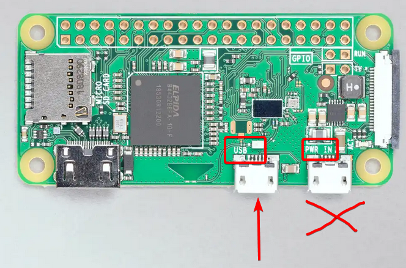

# PSNextcloudUSB

Use a Raspberry Pi Zero as a fake USB dongle to upload screenshots, videos and system backups to a Nextcloud instance

2026 Haruka

Licensed under GPL v3.

-----------------

PSNextcloudUSB allows you to use a Raspberry Pi Zero as USB storage device that uploads all files stored on it to a Nextcloud instance, bypassing Sony's PS App compression or having to manually copy things with USB drives.

video

# Requirements

* A Raspberry Pi Zero W (1 or 2)
* A MicroSD card of any size 
  * PSNextcloudUSB will wipe all files on every start, so the SD card size would basically just limit how much you can upload in one go.
* WiFi
* Internet connection during installation
  * If your Nextcloud is in LAN, the device can be blocked from accessing the internet after if you desire
* A Nextcloud instance (managed or self-hosted)

# Installation

1. Plug your microSD card into your PC.
2. Download the Raspberry Pi Imager from https://www.raspberrypi.com/software/ and run it.
   1. Select whatever model of Pi Zero W you have.
   2. For Operating System, choose "Raspberry Pi OS (other)", then "Raspberry Pi OS Lite".
   3. Select your microSD card.
   4. Hostname can be anything, I personally use "pstransfer"
   5. Set date and keyboard layout.
      * You MUST set the timezone exactly the same as your Playstation's, otherwise you will have weird issues with the delay setting.
   6. Set any login that you can remember.
   7. Enter your WiFi name and password.
   8. Enable SSH.
3. After installation, eject the microSD card from your PC, and insert it in the Pi.
4. Connect the Pi to any power source.
   * If you want, you can already connect it to your PS at this point. (The PS must be turned on to supply power.)
   * Make sure to connect the USB cable not on the "PWR IN" connector, but on the "USB" connector: 
5. Wait for the Pi to start up. This may take several minutes.
6. Connect to the Pi via SSH.
   * The Pi's local IP address can usually be found on your router's "connected devices" list.
   * On some DNS setups, the hostname you entered during the installation process may also work.
7. Log in with the previously entered username and password.
8. Run following command: `wget https://raw.githubusercontent.com/akechi-haruka/PSNextcloudUSB/refs/heads/master/install.sh && chmod +x install.sh && sudo ./install.sh`
   * If online installation is not available, download the code of this repository as a zip file, as well as install.sh, place both files in a directory and run `./install.sh PSNextcloudUSB-master.zip`
9. Follow any steps the installer requests.
10. Enjoy!
   * The device will turn on and off with your Playstation. This will take a minute or two until the "USB" option shows up.
   * All data stored on it will be wiped on each start.

# Notes

* To edit the configuration after installation, either connect via SSH and edit /boot/firmware/psnextcloudusb/config.properties, or remove the SD card and edit the file from your PC.
* To prevent uploading incomplete files, upload will only be performed if no files have been written for 5 minutes. This time limit can be changed in the configuration.
* To change the size of the virtual USB, over SSH, run `dd if=/dev/zero of=/usbdisk.img count=0 obs=1 seek=?M` where ? is a number denoting the desired size in megabytes for the virtual USB storage device. (ex. "2000M" for 2 GB)

# Direct iSCSI access

> **Warning**
>
> Concurrent writing WILL break all data on the device! If that happens, unplug and replug it.

You can also access the temporary storage directly via iSCSI as well:

1. Run "iSCSI Initiator" from the start menu.
2. Under "Target", enter your Pi's local IP address, and hit "Quick Connect..."
3. Select "iqn.2026-06.local:psnextcloudusb" and hit "Connect"
4. Hit Finish and OK.
5. The drive should show up in Windows Explorer.

# Troubleshooting

## There's no USB drive connected. CE-110207-1

* Are you sure you are using the USB connector and not the power connector?
* Try connecting the Pi to your PC and wait two minutes. Does a USB drive show up?
* Connect to the Pi via SSH and run `journalctl -u massstorage` to check for any errors. The output should be this, with no other errors ("1 session requested, but 1 already present - Could not log into all portals" can be ignored)

```
Jun 01 18:44:09 ptransfer systemd[1]: Started massstorage.service - USB Mass Storage Gadget.
Jun 01 18:44:09 ptransfer bash[845]: 127.0.0.1:3260,1 iqn.2026-06.local:psnextcloudusb
Jun 01 18:44:09 ptransfer bash[846]: iscsiadm: default: 1 session requested, but 1 already present.
Jun 01 18:44:09 ptransfer bash[846]: iscsiadm: Could not log into all portals
Jun 01 18:44:09 ptransfer bash[847]: mkfs.fat 4.2 (2021-01-31)
Jun 01 18:44:09 ptransfer systemd[1]: massstorage.service: Deactivated successfully.
```

## Files can be written to the USB but aren't getting uploaded to Nextcloud

* Remove the SD card from the Pi and connect it to your computer. Open <drive named "boot">\psnextcloudusb\config.properties and check if URL, username and password are correct.
* Connect to the Pi via SSH and run `journalctl -u psnextcloudusb` to check for any errors.

